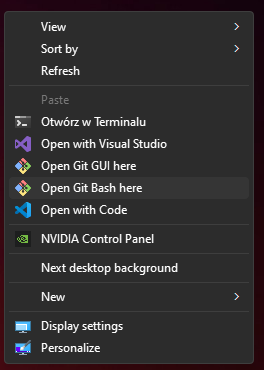

# Knur Kursy Fronted

## Windows

### Getting started

#### 1. Download Node.js stable. - https://nodejs.org/dist/v18.18.0/node-v18.18.0-x64.msi
#### 2. Download Git for Windows. - https://github.com/git-for-windows/git/releases/download/v2.42.0.windows.2/Git-2.42.0.2-64-bit.exe
#### 3. Download WebStorm. - https://www.jetbrains.com/webstorm/download/download-thanks.html?platform=windows - or - Visual Studio Code - https://code.visualstudio.com/sha/download?build=stable&os=win32-x64-user
#### 4. Open Git Bash.

#### 5. Paste `git clone git@github.com:fvlvte/knursy-frontend.git`.
#### 6. Paste `cd knursy-frontend`.
#### 7. Paste `npm install -g pnpm`.
#### 8. Paste `pnpm install`.
#### 9. Paste `pnpm run dev`.
#### 10. Open in browser `http://localhost:5173`.

### How to start again (redo this steps always to avoid conflicts in Git)
#### 1. Open Git Bash (point 4 of getting started) inside project directory.
#### 2. Paste `git fetch && git pull origin (git rev-parse --abbrev-ref HEAD)`.
#### 3. Paste `pnpm install`.
#### 4. Paste `pnpm run dev`.

### How to contribute (work on task)
#### 1. Open Git Bash (point 4 of getting started) inside project directory.
#### 2. Paste `git fetch && git pull origin (git rev-parse --abbrev-ref HEAD)`.
#### 3. Paste `pnpm install`.
#### 4. Paste `git checkout -b <ID of the task>`.
#### 5. Work on the task.
#### 6. Add modified files with `git add <file name>`.
#### 7. Paste `git commit -m "<short description of changes u made>"`.
#### 8. Paste `git push origin (git rev-parse --abbrev-ref HEAD)`.
#### 9. Open in GitHub Pull Request from your branch to main branch (it will suggest it to you).
#### 10. Once your pull request is approved paste `git checkout main && git fetch && git pull origin (git rev-parse --abbrev-ref HEAD)`.
#### 11. Repeat.
